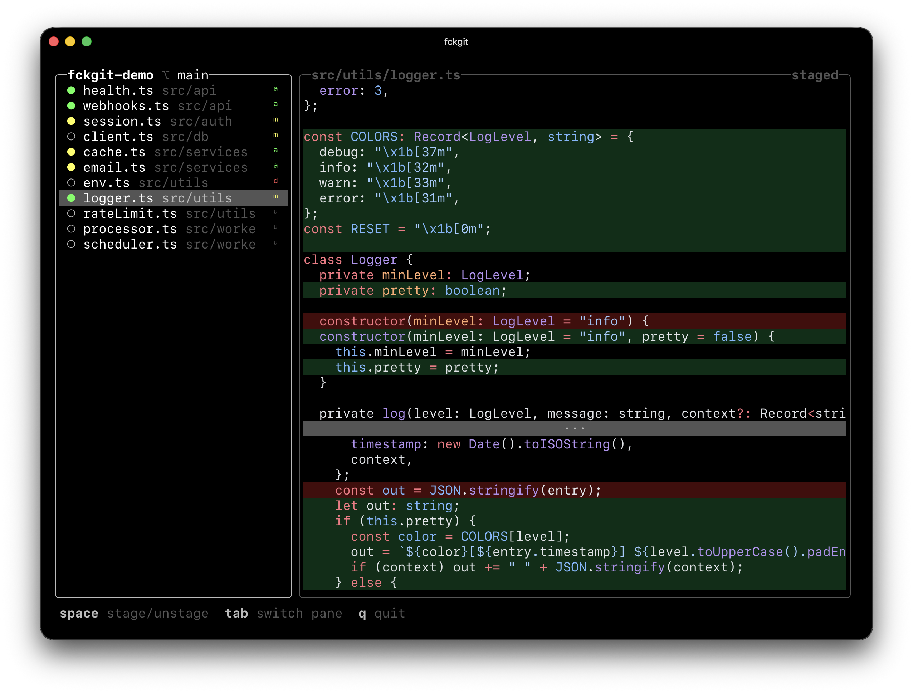

# f\*ckgit

A fullscreen terminal UI for Git.

## Keybindings

| Key            | Action                              |
| -------------- | ----------------------------------- |
| `↑` / `↓`      | Navigate files                      |
| `Space`        | Stage / unstage file                |
| `Tab`          | Switch between files and diff panes |
| `q` / `Ctrl+C` | Quit                                |
